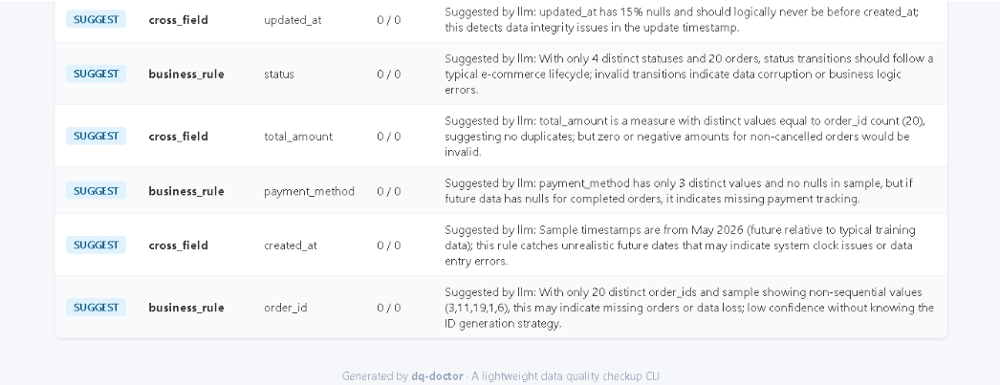

# dq-doctor

**Generate data quality reports from your database in minutes — no YAML, no rule syntax to remember.**

A lightweight CLI that profiles your database tables, auto-generates quality check rules, runs validations, and outputs an HTML report. One command, zero config.


[English](#quick-start) | [中文说明](#中文说明)

## Quick Start

```bash
# Install
pip install dq-doctor

# Generate a demo database to try it out
dqdoctor demo

# List tables
dqdoctor tables --db examples/ecommerce/demo.duckdb

# Profile a table
dqdoctor profile --db examples/ecommerce/demo.duckdb --table orders

# Full check: profile + rules + validate + HTML report
dqdoctor check --db examples/ecommerce/demo.duckdb --table orders --out report.html

# Check all tables at once
dqdoctor check --db examples/ecommerce/demo.duckdb --all-tables --out report.html

# Export rules to dbt / Great Expectations / Markdown
dqdoctor export --db examples/ecommerce/demo.duckdb --table orders --format dbt --out schema.yml
dqdoctor export --db examples/ecommerce/demo.duckdb --table orders --format gx --out suite.json
dqdoctor export --db examples/ecommerce/demo.duckdb --table orders --format markdown --out dict.md
```

That's it. Open `report.html` in your browser.

## What It Does

```
DuckDB (first-class)
  → Profile table structure & column distributions
  → Auto-generate quality rules (not_null, unique, accepted_values, range, freshness)
  → Execute validations
  → Output HTML report
  → Export to dbt schema.yml / Great Expectations / Markdown
```

**Every rule comes with a human-readable reason** — so you know *why* the rule was suggested, not just *what* it checks.

## Example Output

```
orders: Rules 14  Passed 14  Failed 0
  PASS not_null on order_id: All 20 rows have non-null 'order_id'.
  PASS unique on order_id: All 20 values in 'order_id' are unique.
  PASS range on total_amount: All 20 values within [45.00, 680.00].
  PASS accepted_values on status: All 20 non-null values in accepted set.
  PASS freshness on created_at: Latest value is 3.0h old (max 24h).
```

## Supported Rules

| Rule | How It's Triggered | Example |
|------|--------------------|---------|
| `not_null` | Column has zero nulls, or is an identifier field | `order_id` has no nulls → require not_null |
| `unique` | Identifier field with ≥98% distinct rate | `user_id` is nearly unique → require unique |
| `accepted_values` | Category field with ≤20 distinct values | `status` has 4 values → constrain to that set |
| `range` | Numeric column | `total_amount` in [45.00, 680.00] |
| `freshness` | Timestamp field | `created_at` should be within 24h |

## Export Formats

```bash
# Starter dbt schema.yml with column tests
dqdoctor export --format dbt --out schema.yml

# Great Expectations Expectation Suite JSON
dqdoctor export --format gx --out suite.json

# Markdown data dictionary
dqdoctor export --format markdown --out dict.md
```

Note: dbt export generates a starter schema.yml structure. You may need to adjust test types (e.g. `range`) to match your dbt version and packages.

## LLM-Enhanced Rules (Experimental)

Pass an LLM API key to get additional business rules beyond the heuristic ones:



```bash
dqdoctor check --db demo.duckdb --table orders ^
  --llm-key "sk-xxx" ^
  --llm-base-url "https://api.deepseek.com/v1" ^
  --llm-model "deepseek-chat"
```

Without `--llm-key`, dqdoctor runs purely with deterministic heuristic rules. Requires `pip install dq-doctor[llm]`.

## CI Mode

Use in CI/CD pipelines — exits with code 1 when failures exceed threshold:

```bash
dqdoctor check --db demo.duckdb --table orders --ci --max-failures 0
```

## Why Not Great Expectations / Soda / dbt?

dq-doctor is **not** a replacement — it's a **quick checkup layer** that runs *before* you invest in heavy tooling:

- **Great Expectations / Soda**: Powerful but require YAML configs, expectation suites, and setup. dqdoctor gives you a first-pass report with zero config.
- **dbt tests**: Great for ongoing CI, but you need to write tests first. dqdoctor *suggests* tests for you and can export a starter schema.yml.
- **Think of it as**: `dqdoctor check` → discover issues → export to dbt/GX → refine.

## 中文说明

dqdoctor 是一个轻量级数据质量体检 CLI 工具。你不需要手写 YAML，不需要记 Great Expectations 或 dbt 的规则语法，只需要一行命令，就能对数据库表做 profiling、自动生成质量检查规则、执行校验并输出 HTML 报告。


### 快速开始

```bash
# 安装
pip install dq-doctor

# 生成示例数据库
dqdoctor demo

# 列出所有表
dqdoctor tables --db examples/ecommerce/demo.duckdb

# 对单表做 profiling
dqdoctor profile --db examples/ecommerce/demo.duckdb --table orders

# 完整检查：profiling + 规则生成 + 校验 + HTML 报告
dqdoctor check --db examples/ecommerce/demo.duckdb --table orders --out report.html

# 一次性检查所有表
dqdoctor check --db examples/ecommerce/demo.duckdb --all-tables --out report.html

# 导出规则为 dbt / Great Expectations / Markdown
dqdoctor export --db examples/ecommerce/demo.duckdb --table orders --format dbt --out schema.yml
dqdoctor export --db examples/ecommerce/demo.duckdb --table orders --format gx --out suite.json
dqdoctor export --db examples/ecommerce/demo.duckdb --table orders --format markdown --out dict.md
```

打开 `report.html` 即可查看报告。

### 它做了什么

```
DuckDB（一等支持）
  → 分析表结构和字段分布
  → 自动生成质量规则（not_null, unique, accepted_values, range, freshness）
  → 执行校验
  → 输出 HTML 报告
  → 导出为 dbt schema.yml / Great Expectations / Markdown
```

**每条规则都有可读的生成原因** — 你不仅知道检查了什么，还知道为什么建议这个规则。

### 示例输出

```
orders: Rules 14  Passed 14  Failed 0  Suggested 0
  PASS not_null on order_id: All 20 rows have non-null 'order_id'.
  PASS unique on order_id: All 20 values in 'order_id' are unique.
  PASS range on total_amount: All 20 values within [45.00, 680.00].
  PASS accepted_values on status: All 20 non-null values in accepted set.
  PASS freshness on created_at: Latest value is 3.0h old (max 24h).
```

### 支持的规则

| 规则 | 触发条件 | 示例 |
|------|----------|------|
| `not_null` | 字段零空值，或被推断为标识符 | `order_id` 没有空值 → 要求 not_null |
| `unique` | 标识符字段且唯一率 ≥98% | `user_id` 近乎唯一 → 要求 unique |
| `accepted_values` | 分类字段且不同值 ≤20 个 | `status` 有 4 个值 → 约束为这 4 个 |
| `range` | 数值字段 | `total_amount` 在 [45.00, 680.00] |
| `freshness` | 时间戳字段 | `created_at` 应在 24 小时以内 |

### 导出格式

```bash
# dbt schema.yml（含 column tests）
dqdoctor export --format dbt --out schema.yml

# Great Expectations Expectation Suite JSON
dqdoctor export --format gx --out suite.json

# Markdown 数据字典
dqdoctor export --format markdown --out dict.md
```

注意：dbt 导出生成的是 starter 格式的 schema.yml。range 规则使用 `dbt_utils.expression_is_true`，需要安装 dbt-utils 包。

### LLM 增强规则（实验性）

传入 LLM API key 可以在启发式规则之外获得额外的业务规则建议：


```bash
dqdoctor check --db demo.duckdb --table orders ^
  --llm-key "sk-xxx" ^
  --llm-base-url "https://api.deepseek.com/v1" ^
  --llm-model "deepseek-chat"
```

不传 `--llm-key` 时 dqdoctor 只运行确定性启发式规则。LLM 功能需要 `pip install dq-doctor[llm]`。

LLM 生成的规则显示为 **SUGGEST** 状态（未实际校验），与通过/失败的规则分开统计。

### CI 模式

在 CI/CD 流水线中使用 — 失败数超过阈值时 exit 1：

```bash
dqdoctor check --db demo.duckdb --table orders --ci --max-failures 0
```

### 为什么不用 Great Expectations / Soda / dbt？

dq-doctor **不是**替代品 — 它是一个**快速体检层**，在你投入重型工具之前先跑一轮：

- **Great Expectations / Soda**：功能强大但需要 YAML 配置、Expectation Suite 和初始化。dqdoctor 零配置给你第一轮报告。
- **dbt tests**：适合持续 CI，但你得先写测试。dqdoctor 帮你*建议*测试，还能导出 starter schema.yml。
- **定位**：`dqdoctor check` → 发现问题 → 导出到 dbt/GX → 精细化。

### 适用人群

数据开发工程师、数仓工程师、数据平台实习生。

### 技术栈

- Python 3.9+
- [Typer](https://typer.tiangolo.com/) — CLI 框架
- [DuckDB](https://duckdb.org/) — 嵌入式分析数据库
- [Pydantic](https://docs.pydantic.dev/) — 数据模型
- [Jinja2](https://jinja.palletsprojects.com/) — HTML 报告模板
- [Rich](https://rich.readthedocs.io/) — 终端输出

## Tech Stack

- Python 3.9+
- [Typer](https://typer.tiangolo.com/) — CLI framework
- [DuckDB](https://duckdb.org/) — embedded analytical database
- [Pydantic](https://docs.pydantic.dev/) — data models
- [Jinja2](https://jinja.palletsprojects.com/) — HTML report templates
- [Rich](https://rich.readthedocs.io/) — terminal output

## Development

```bash
git clone https://github.com/pugyy/dq-doctor.git
cd dq-doctor
pip install -e ".[dev]"

# Run tests (66 tests)
pytest tests/ -v

# Lint
ruff check dqdoctor/ tests/

# Try the demo
dqdoctor demo
dqdoctor check --db examples/ecommerce/demo.duckdb --table orders
```

## Roadmap

- [x] PostgreSQL / MySQL connector framework (DuckDB first-class)
- [x] dbt schema.yml native format export
- [x] LLM-enhanced rule suggestions
- [x] PyPI published (v0.2.0)
- [ ] Demo GIF
- [ ] PostgreSQL / MySQL real integration testing

## License

MIT
